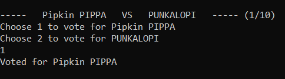
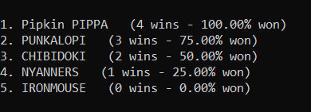
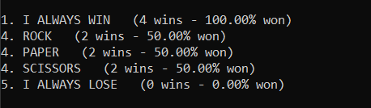

# Ranking list script
A short Python script that takes entries from a file, pairs all of them and asks the user which one of the two wins. Then it prints the entries ranked, sorted by the number of wins.

Right now it matches each entry against all other entries, resulting in the match count being the *n*-th triangular number with the number of entries being *n+1*. This makes the number of choices the user has to make unreasonably high for higher numbers of entries - for example with 5 entries there are 10 choices to make, but having 15 choices you need to resolve 105 match-ups.

# Usage
To use this script you need Python 3 installed.

To run the script simply run a command `python ranking.py` in the directory the script is located in. The script will read the file `in-file.txt`, taking each line as an entry for comparison. An example file is provided.

After running the script you will be presented with two random entries, and prompted to choose one you prefer more. Enter `1` or `2` depending on your choice and press `Enter` to confirm:

The program will continue presenting option pairs until all possible pairs are depleted. After going through all of them, you will be presented with resulting ranking, with all entries you provided sorted and numbered accordingly to their placement, as shown here: 

Sometimes entries may not compare on even terms with all the other entries, resulting in rock-paper-scissors like situations. In that case the resulting win counts for the entries may distribute in a non-linear fashion and ties may also happen. The ties will not be resolved, and the results will be presented as in the following example:

The results will be printed to the standard output and to a file "out-file.txt" in the directory the script is located in. **The output file will be overwritten.** 

# TODO (may or may not ever implement)
* Option to reduce the number of matches in a fair way
* Option to go back and change an answer 
* Pretty up the prompts
* Add arrow controls without a need to confirm every choice
